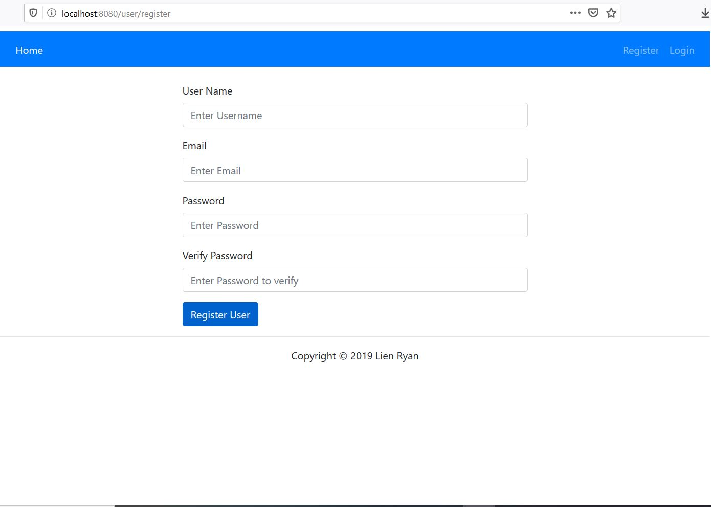
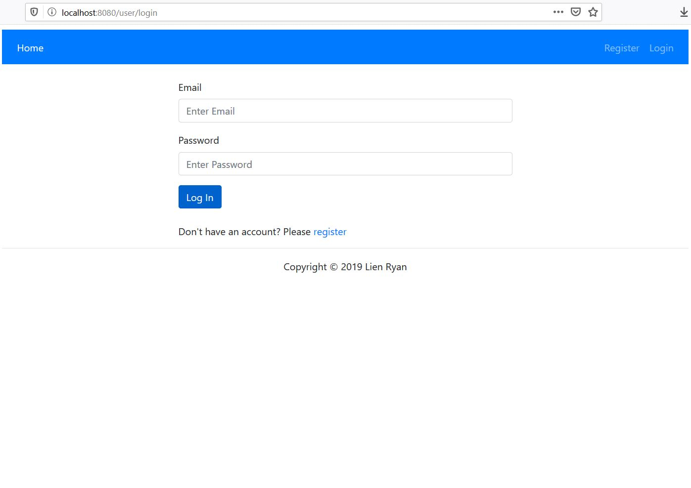
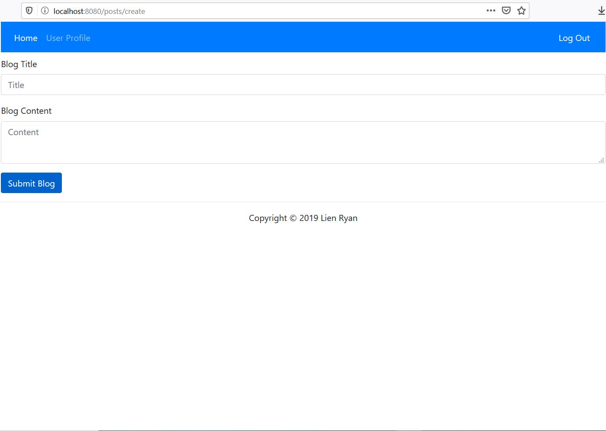
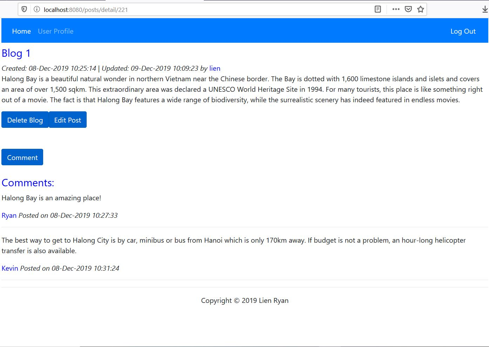
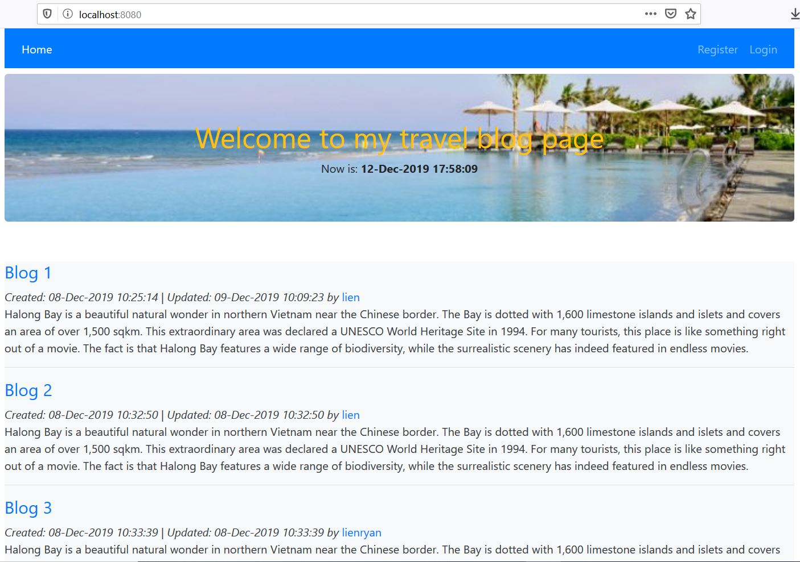
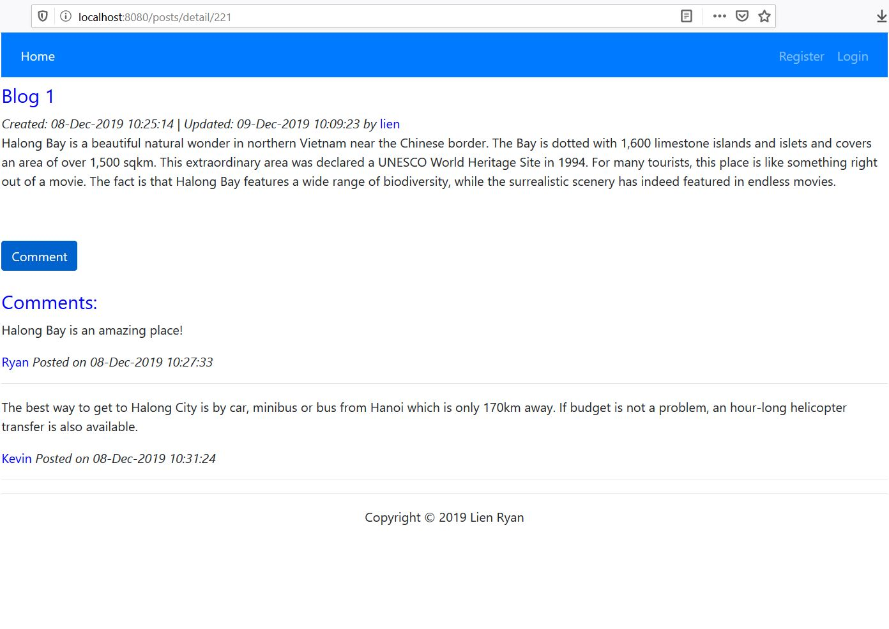
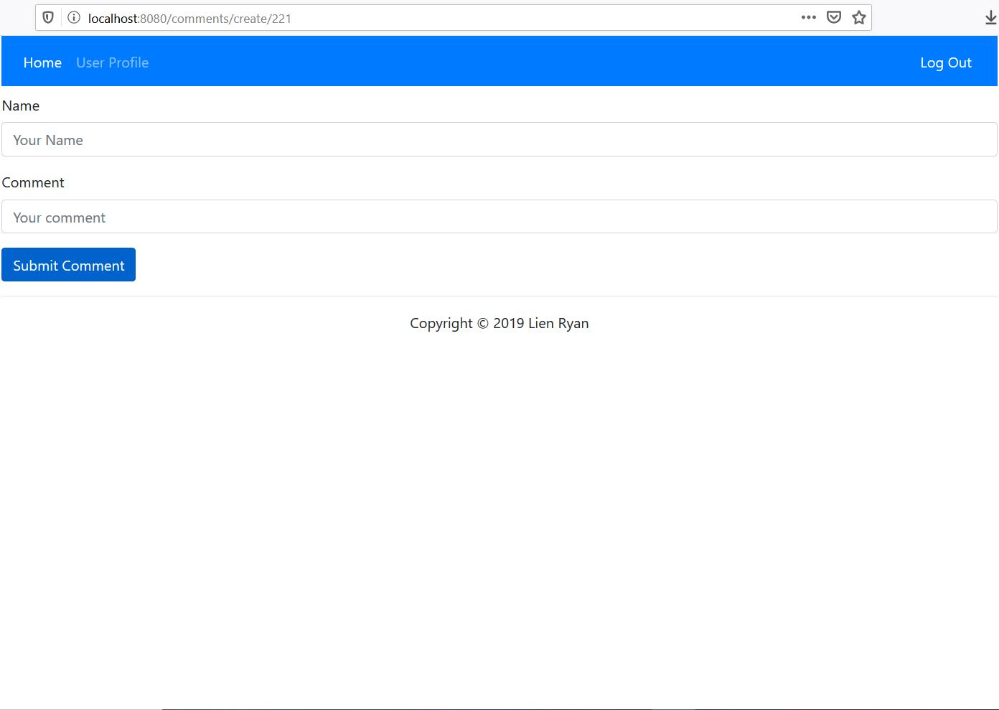

# blog-liftoff

## Overview

My project is a travel blog that allows users to create and read blog posts. Users are be able to create an account, log in, create, edit and delete their blog posts.

I decided to make this project because I am passionate about travelling and I want to share my experiences with the amazing places I have travelled. This is the place for users to share their travel experiences.

## Features

User login: Users are be able to create accounts and log in to the application. Each user will have a profile page.
 
 
- Create Post: Users are be able to create new blog posts when logged in. New posts will appear in the user’s profile.
 
- Edit Post: Users are be able to edit/delete their blog posts.
 
- Everyone can view list of blog posts and comment on each post.
 
 
 

## Technologies

- Java
- Spring Boot
- MySQL
- Thymeleaf templates
- Bootstrap

## What I Learned

- I learned more about bootstrap to make the website look better.
- Spring Security

## What's Next

- List of posts is sorted so viewers can see newest posts
- List of comments is sorted so viewers can see newest comments
- Role Admin can view a list of users
 
## License
[GNU General Public License v3](LICENSE)
